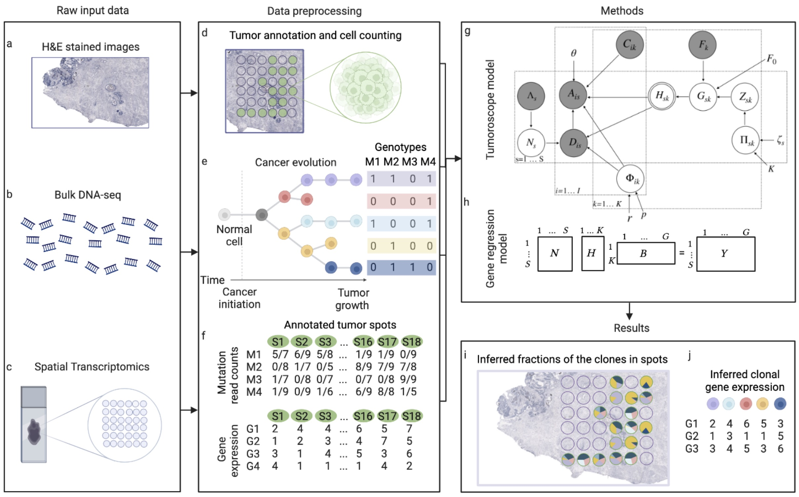
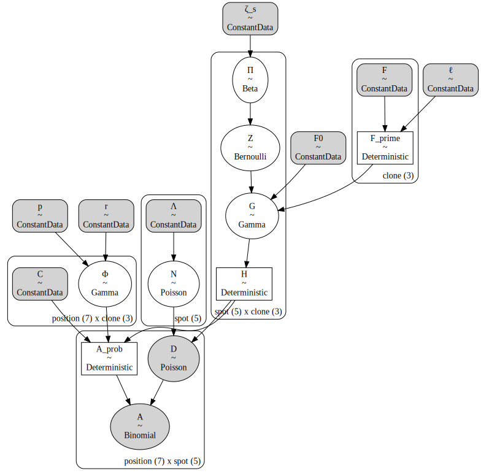

<!-- Do NOT edit the Markdown file directly - generated from the Jupyter notebook. -->

# Tumoroscope in PyMC

[](https://www.python.org)
[](https://github.com/jhrcook/tumoroscope-pymc/actions/workflows/pytest.yaml)
[](https://github.com/psf/black)
[](https://github.com/pre-commit/pre-commit)
[](http://mypy-lang.org/)
[](http://www.pydocstyle.org/en/stable/)
[](https://www.gnu.org/licenses/gpl-3.0)

**This package is a Work-in-Progress.**

This package builds the ['Tumoroscope']() (Shafighi *et al.*, 2022, bioRxiv preprint) model with the probabilistic programming library [PyMC]().
'Tumoroscope' is a "probabilistic model that accurately infers cancer clones and their high-resolution localization by integrating pathological images, whole exome sequencing, and spatial transcriptomics data."



## Installation

> As this package provides a model produced using PyMC, I recommend first creating a virtual environment using `conda` and installing the PyMC library.
> You can follow their instructions [here](https://www.pymc.io/projects/docs/en/latest/installation.html).

You can install this package using `pip` either from PyPI

```bash
pip install tumoroscope-pymc  # not available yet
```

or from GitHub

```
pip install git+https://github.com/jhrcook/tumoroscope-pymc.git
```

## Use

(TODO)


```python
import numpy as np
import pymc as pm

from tumoroscope import TumoroscopeData, build_tumoroscope_model
from tumoroscope.mock_data import generate_random_data

np.random.seed(1)
data = generate_random_data()

model = build_tumoroscope_model(data)
pm.model_to_graphviz(model)
```





## Developing

Setup up the develpment envionrment using `conda` (or `mamba`)

```bash
mamba env create -f conda.yaml
conda activate tumoroscope-pymc
```

Run the test suite using `tox`

```bash
tox
```

Build the README documentation by re-executing the `README.ipynb` notebook and converting it to Markdown using the following command

```bash
tox -e readme
```

---

## Environment information


```python
%load_ext watermark
%watermark -d -u -v -iv -b -h -m
```

    Last updated: 2022-10-24

    Python implementation: CPython
    Python version       : 3.10.6
    IPython version      : 8.5.0

    Compiler    : Clang 13.0.1
    OS          : Darwin
    Release     : 21.6.0
    Machine     : x86_64
    Processor   : i386
    CPU cores   : 4
    Architecture: 64bit

    Hostname: JHCookMac.local

    Git branch: dev

    numpy: 1.23.4
    pymc : 4.2.2
